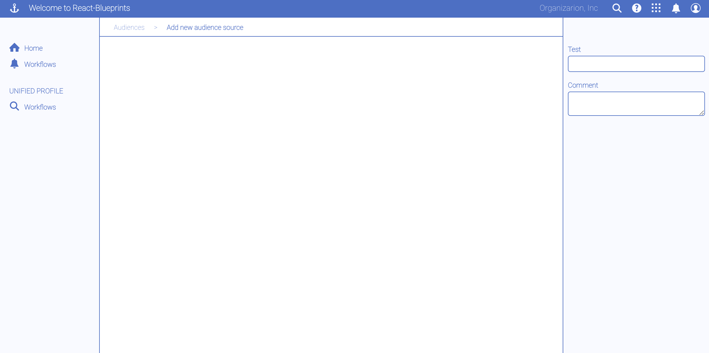
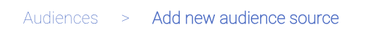
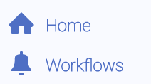
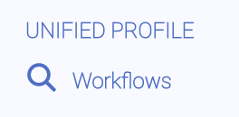
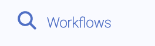
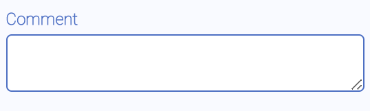
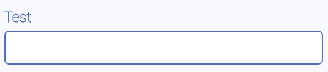

# React-based Component Library for a blueprint style

# Build
```sh
npm i
```

Run
```sh
npm start
```

# Components



## Shell, ShellBody, Content
An application shell. At current time this component is not generic

```jsx
<Shell>
  <HeaderBar title="Welcome to React-Blueprints" logo="anchor"></HeaderBar>
  <ShellBody>
    <LeftMenuRail collapsed={false}></LeftMenuRail>
    <Content>
      <BreadCrumb items={[ "Audiences", "Add new audience source" ]}></BreadCrumb>
      <RightRail></RightRail>
    </Content>
  </ShellBody>
</Shell>
```

## HeaderBar

An horizontal header bar. At current time this component is not generic

## LeftMenuRail

A left-side navigation rail. At current time this component is not generic

## RightRail

A right-side properties rail. At current time this component is not generic

## BreadCrumb
A breadcrumb component



| prop | Comment / Description |
|----|---|
| items | An array of breadcrumb items. Each item in the array is a string with the breadcrumb text

## Form
An HTML form which lays out is children in column.

| prop | Comment / Description |
|----|---|

## Icon
A inline icon. Only a few icons are available: "anchor", "bell", "apps", "search", "login", "help", and "home"



| prop | Comment / Description |
|----|---|
| name | The icon name
| style | The icon style: "normal" or "inverted"

## Menu

A vertical menu to display in a left-side navigation rail.



| prop | Comment / Description |
|----|---|
| title | the menu title

## MenuItem

An item in a menu, made of an icon and a label



| prop | Comment / Description |
|----|---|
| title | the text of the menu item
| icon | the name of the icon (see Icon component)

## TextArea
A multi-line text field with its label on top



| prop | Comment / Description |
|----|---|
| label | A caption for the text field

## TextField
A text field with its label on top



| prop | Comment / Description |
|----|---|
| label | A caption for the text field